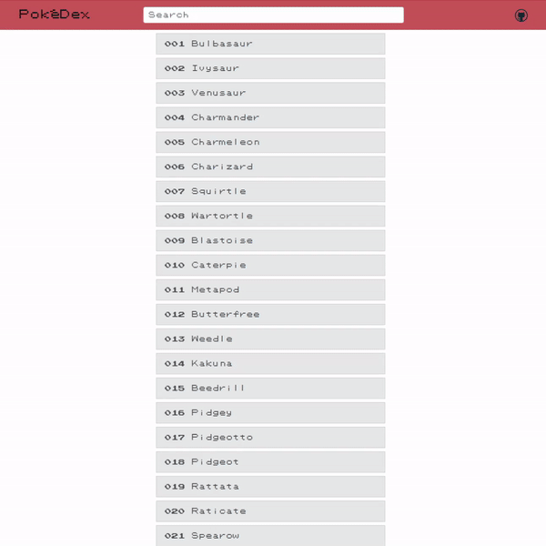

# PokeDex

[Link to Live Project](https://ryrojas.github.io/js-pokedex/)

## Description

This is a simple PokeDex app built using vanilla JavaScript. The main goals for this project were to practice working with an external API (**PokeAPI**) and a frontend framework (**Bootstrap**).

## Features

- App calls the PokeAPI and displays the retrieved Pokemon in a list.
- User is able to search that list via the search bar
- User is able to view a pokemon's details by clicking on it in the list.
- Pokemon details are requested from the PokeAPI and displayed in a modal.
- User is able to close the modal by clicking the close button or by clicking outside of the modal.

# Dependencies

- ES2015/ES6
- [Bootstrap 4.6](https://getbootstrap.com/docs/4.6/getting-started/introduction/) (For IE compatibility)
  - Jquery 3.5.1
  - Popper 1.16.1
- [PokeAPI v2](https://pokeapi.co/)
